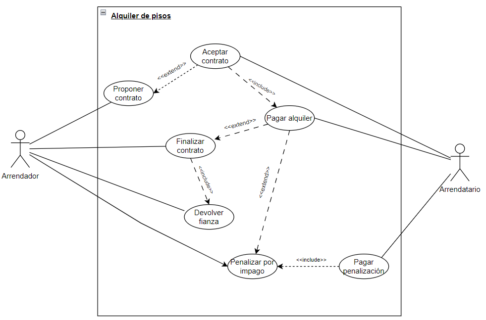

# Ejercicio 6

## 1. Análisis y definición del escenario

El contrato **AlquilerPisos** está diseñado para gestionar alquileres de viviendas en un entorno descentralizado. En este escenario, las partes involucradas interactúan directamente a través del contrato inteligente, eliminando la necesidad de intermediarios.

La implementación de este contrato en la blockchain de Ethereum busca cumplir con una serie de **requisitos no funcionales**:

- **RFN-01**. Inmutabilidad: Los registros de transacciones, como el pago del alquiler o la devolución de fianzas, no podrán ser alterados.
- **RFN-02**. Transparencia y visibilidad: Las partes involucradas, el arrendador y arrendatario, tienen acceso completo a la información relevante del contrato.
- **RFN-03**.Descentralización: Al ejecutarse en una blockchain pública, el contrato no depende de una entidad centralizada.
- **RFN-04**. Automatización: La ejecución automática de procesos, como el pago de alquiler y la devolución de fianzas, elimina la necesidad de intermediarios y garantiza que se cumplan sin intervención manual.

A continuación se detallan los **requisitos funcionales** del contrato:

- **RF-01**. Proponer contrato: Permite al arrendador proponer nuevas condiciones de contrato, duración y precio, antes de los 30 días del final del contrato actual, siempre que no exista otra propuesta pendiente. Una vez propuesta, el arrendatario debe aceptarla dentro de un plazo de 30 días.

- **RF-02**. Aceptar contrato: El arrendatario podrá aceptar la propuesta dentro del período especificado, activando así las nuevas condiciones del contrato.

- **RF-03**. Pago del alquiler: Si el contrato está activo y el plazo del pago está dentro del mes (30 días), el arrendatario podrá realizar el pago del alquiler. Si es el primer mes, el arrendatario deberá pagar tanto el alquiler como la fianza. Si no se paga a tiempo, se aplica la penalización por impago.

- **RF-04**. Penalizar por impago: Si el arrendatario no realiza el pago del alquiler a tiempo, el arrendador podrá establecer una penalización. Esta penalización se calcula en función del tiempo transcurrido desde la fecha de vencimiento del pago y se asigna una cantidad específica como sanción por el incumplimiento.

- **RF-05**.Pagar penalización: El arrendatario podrá pagar la penalización establecida si se ha excedido el plazo de pago. Esta función asegura que se realice el pago correcto de la penalización y que el arrendador reciba la cantidad correspondiente.

- **RF-06**.Finalizar contrato: El arrendador podrá finalizar el contrato por diferentes motivos:
  - **Mutuo acuerdo**: En este caso, se devuelve la fianza al completo.
  - **Incumplimiento, daños**: En este caso, se devuelve la fianza reducida.
  - **Desalojo**: En este caso, no se devuelve la fianza y se aplica una penalización del 10% de la fianza.
  - **Cambio arrendador**: Permite cambiar el arrendador del contrato.

- **RF-07**.Devolver fianza: Al finalizar el contrato, se comprueba que el contrato no haya finalizado, que la fianza no haya sido devuelta y que la cantidad a retener por daños o incumplimientos no exceda la cantidad de la fianza estipulada. Si se cumplen estas condiciones, el arrendador puede devolver la fianza al arrendatario, descontando las deducciones correspondientes según lo establecido.

## 2. Diseño

### 2.1. Definir un caso de uso (Pagar el alquiler)

1. El arrendatario ejecuta la función `pagarAlquiler`.
2. El contrato verifica que el pago se realiza antes de la fecha de vencimiento y que está activo.
3. El contrato transfiere la cantidad correspondiente al arrendador.
4. Se actualiza la fecha de vencimiento para el próximo mes, sumando 30 días.
5. Se emite un evento que indica que el pago ha sido realizado.

### 2.2. Definir el contenido del contrato inteligente.
#### 2.2.1. Datos
- **arrendador**: Almacena la dirección del arrendador (propietario de la vivienda).
- **arrendatario**: Almacena la dirección del arrendatario (inquilino de la vivienda).
- **precioAlquiler**: Almacena el precio del alquiler.
- **fianzaAlquiler**: Almacena el precio de la fianza.
- **duracionContrato**: Almacena la duración del contrato de alquiler en días.
- **fechaInicioContrato**: Registra la fecha de inicio del contrato.
- **fechaVencimientoPago**: Registra la fecha límite para el pago del alquiler.
- **fianzaDevuelta**: Indica si la fianza ha sido devuelta al arrendatario.
- **contratoActivo**: Indica si el contrato de alquiler está actualmente activo.
- **pagoPrimerMes**: Indica si el pago del primer mes (que incluye la fianza) ha sido realizado.
- **penalizacion**: Almacena la cantidad de penalización impuesta por impago.
- **motivosFinalizacion**: Enumera los diferentes motivos por los cuales se puede finalizar el contrato: `INCUMPLIMIENTO`, `MUTUOACUERDO`, `NORENOVACION`, `DESALOJO`, `DAMAGE`, `CAMBIOARRENDADOR`, `RENUNCIA`.
- **nuevaDuracionPropuesta**: Almacena la nueva duración del contrato que el arrendador propone. 
- **nuevoPrecioPropuesta**: Almacena el nuevo precio del contrato que el arrendador propone. 
- **propuestaPendiente**: Indica si hay una propuesta de contrato pendiente de aceptación por parte del arrendatario.
- **plazoPropuesta**: Almacena el momento en el que se realizó la propuesta.

#### 2.2.2. Eventos

- **pagoRealizado**: Se emite cuando el arrendatario realiza un pago del alquiler.
- **devolucionFianza**: Se emite cuando la fianza es devuelta al arrendatario.
- **propuestaRenovacion**: Se emite cuando el arrendador propone una nueva renovación del contrato.
- **acuerdoAlcanzado**: Se emite cuando el arrendatario acepta la propuesta de contrato.
- **contratoFinalizado**: Se emite al finalizar el contrato, especificando el motivo.
- **penalizacionEstablecida**: Se emite cuando se establece una penalización por impago.
- **penalizacionPagada**: Se emite cuando el arrendatario paga la penalización.

#### 2.2.3. Modificadores

- **soloArrendador**: Restringe el acceso a las funciones a solo el arrendador. 
- **soloArrendatario**: Restringe el acceso a las funciones a solo el arrendatario. 

#### 2.2.4. Funciones

- **constructor**: Constructor del contrato que se ejecuta una vez al ser desplegado. Inicializa el arrendador, el arrendatario, el precio del alquiler, la fianza, la duración del contrato y las fechas de inicio y vencimiento del primer pago.
- **pagarAlquiler**: Permite al arrendatario realizar el pago del alquiler. 
- **devolverFianza**: Permite al arrendador devolver la fianza al arrendatario al final del contrato.
- **proponerContrato**: Permite al arrendador proponer nuevas condiciones para el contrato de alquiler.
- **aceptarContrato**: Permite al arrendatario aceptar la propuesta de renovación del contrato. 
- **finalizarContrato**: Permite al arrendador finalizar el contrato por diferentes motivos. Dependiendo del motivo, se realizan acciones específicas, como devolver o retener la fianza.
- **penalizarPorImpago**: Permite al arrendador establecer una penalización por impago si se ha excedido la fecha de vencimiento del pago.
- **pagarPenalizacion**: Permite al arrendatario pagar la penalización por impago.

### 2.6. Actores

Este contrato incluye dos partes involucradas: el **arrendador** y el **arrendatario**. El arrendador es el propietario de la vivienda que establece el alquiler. Por otro lado, el arrendatario es la persona que alquila la propiedad.

#### Diagrama de casos de uso
 

## 3. Implementación

Para la implementación de este contrato inteligente se ha empleado un fichero: `AlquilerPisos.sol`.

## 4. Pruebas

Las pruebas del contrato inteligente se realizaron de forma manual con la ayuda de la herramienta **Remix - Ethereum IDE**.

